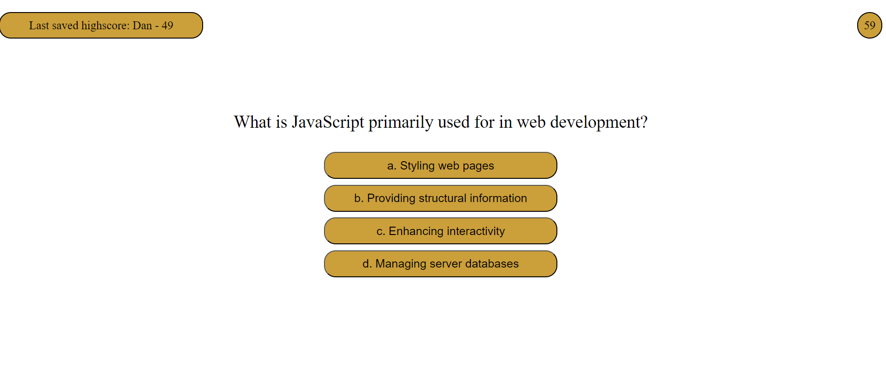

# JavaScript Quiz

## Description

This JavaScript quiz site is made using JavaScript's web api methods, it got 5 question to answer. If the answer is wrong it subtracts 10 seconds from the clock, which starts when "Start" button is clicked. The remaining time then is converted into a score, which saves into local storage by requiring the user to enter their username. Last saved username and score is then displayed to the page.

 The site uses basic principles of responsive desing to make webpage more responsive and user-friendly on most device sizes.

## Installation

N/A

## Usage

Open 'index.html' in any browser, or follow this Git Pages link: [JavaScript Quiz](https://aldu1n.github.io/javascript-quiz/). Click "Start" button and answer the questions.

## Screenshot

## Credits

N/A

## License

N/A